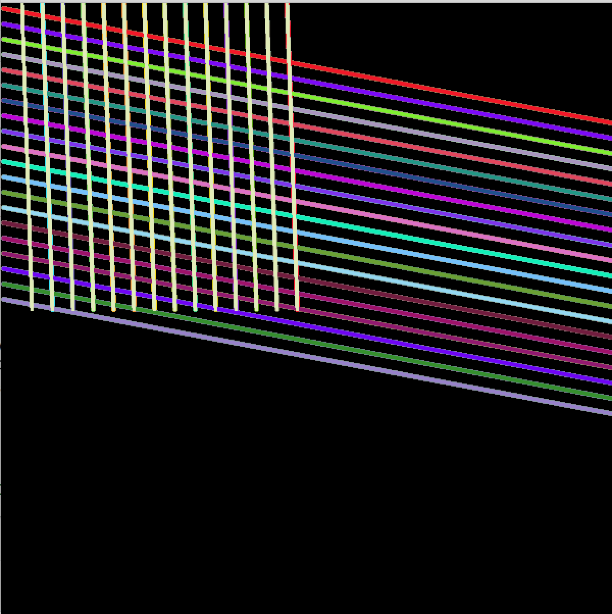

# Processing-2017-18
Processing for Designers at FH Potsdam

# Vertical Lines

This sketch displays an animated pattern of vertical lines. The lines keep changing their colours. When you click new lines appear.
This was one of my first sketches during this class

# Explosion

In this sketch random lines with different colours are drawn from a fixed center. The lines keep getting more and more and each time you open the sketch you get a different animation. 

# Cube

This code is the work of Jan a guy from the class. I added some changes, so when you click the mouse the cube breaks open into
different seperated pieces.

